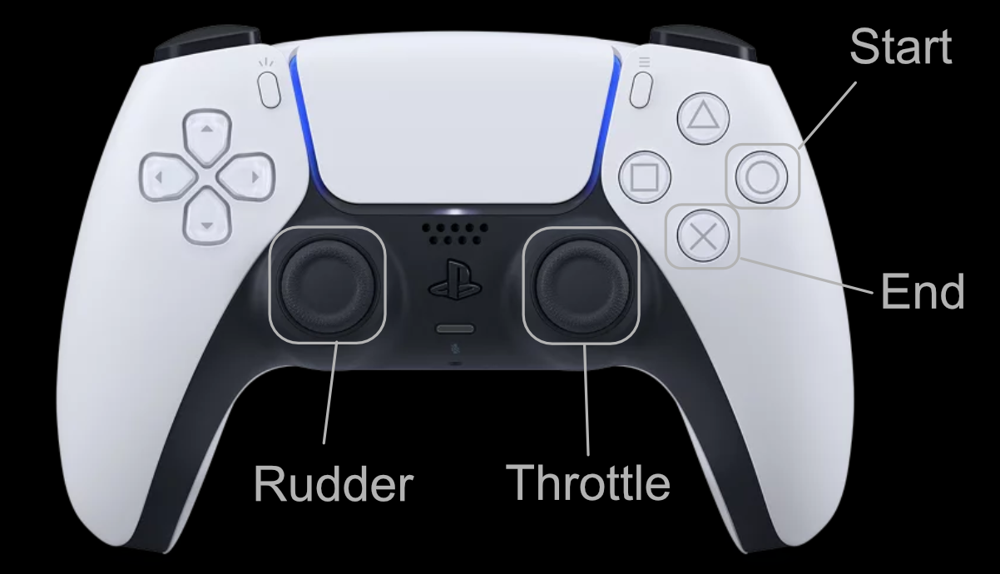

# Pilot A Glider for visionOS 2

This project shows a visionOS app that let users control a glider with a Game Controller like a PlayStation Dualsense.
This app represents a very simple starting point and has no added game elements.
Arrange this project as you like and make it a fun game.

- GitHub : https://github.com/ynagatomo/PilotAGlider
- Xcode 16.2 beta 2 , visionOS 2.1 or 2.2 beta 2+ (<em>visionOS 2.2 beta does not work with this project, due to its issue on Game Controller support.</em>)
- Since this app uses a Game Controller to control a glider, you need to use an Apple Vision Pro and a Game Controller like a PlayStation Dualsense.

<!--

-->

## Game Controller

This app supports only Game Controller as a control way of the glider.
You'll soon want to use hand gestures instead. I'll leave it up to you. :)

## Next Steps

1. Replace the image with HDRI/360 images of the scenery you would like to fly through.
1. Play sound effects such as engine sounds and BGM.
1. Display information on cockpit instruments or HUD.
1. Add environmental VFX such as rain and fog.
1. Add target rings to crawl through as game elements. (move objects relative to each other)
1. Add hand gestures to control the glider instead of a Game Controller.
1. Add IBL using the HDRI/360 images.

* You may want to add the roll, but be careful as this may cause motion sickness.

<!--
Example 1: Flying Space Shuttle

Example 2: Flying Full-size Space Shuttle

-->

## Contribution

You probably already have a lot of ideas.
I want to keep this project simple so that it can be a starting point for many people.
So instead of sending a PR for your awesome improvement, please tell me your forked repo.
I will add that information to this page.

Thanks in advance.

## Credit

- Glider 3D Model: UNDERPOLY Free Spailplane Glider (CC BY 4.0) [Sketchfab](https://sketchfab.com/3d-models/underpoly-free-sailplane-glider-45ffefc38fcf4e76a9d0c2a4e76262ef)
- HDRI Images
    - Kloppenheim 06 (Pure Sky) (CC0), Greg Zaal, Jarod Guest [Poly Haven](https://polyhaven.com/ja/a/kloppenheim_06_puresky)
    - Blouberg Sunrise 2 (CC0), Greg Zaal, Rico Cilliers [Poly Haven](https://polyhaven.com/ja/a/blouberg_sunrise_2)
    - Alps Field (CC0), Andreas Mischok [Poly Haven](https://polyhaven.com/ja/a/alps_field)
    - Pizzo Pernice (CC0), Andreas Mischok [Poly Haven](https://polyhaven.com/ja/a/pizzo_pernice)
    - Kiara 1 Dawn (CC0), Greg Zaal [Poly Haven](https://polyhaven.com/ja/a/kiara_1_dawn)
    - Rogland Clear Night (CC0), Greg Zaal [Poly Haven](https://polyhaven.com/ja/a/rogland_clear_night)

## References

- Apple Documentation: Game Controller Framework [WEB](https://developer.apple.com/documentation/gamecontroller)
- WWDC20: Bring keyboard and mouse gaming to iPad [WEB](https://developer.apple.com/videos/play/wwdc2020/10617)

<!--
## Change logs

click to open

1. [Nov 10, 2024] xxx

-->

## License

MIT License

since Nov, 2024
